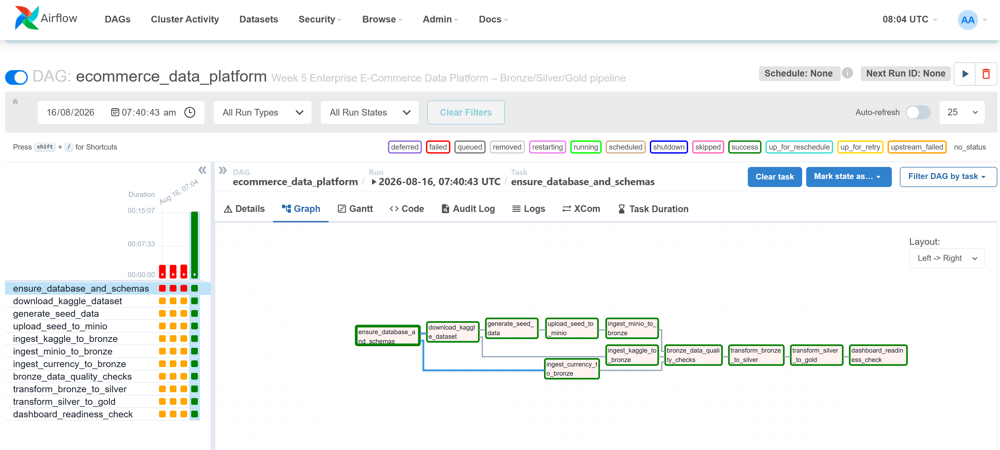
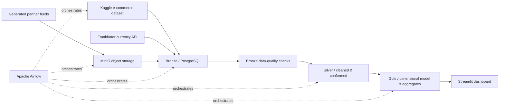
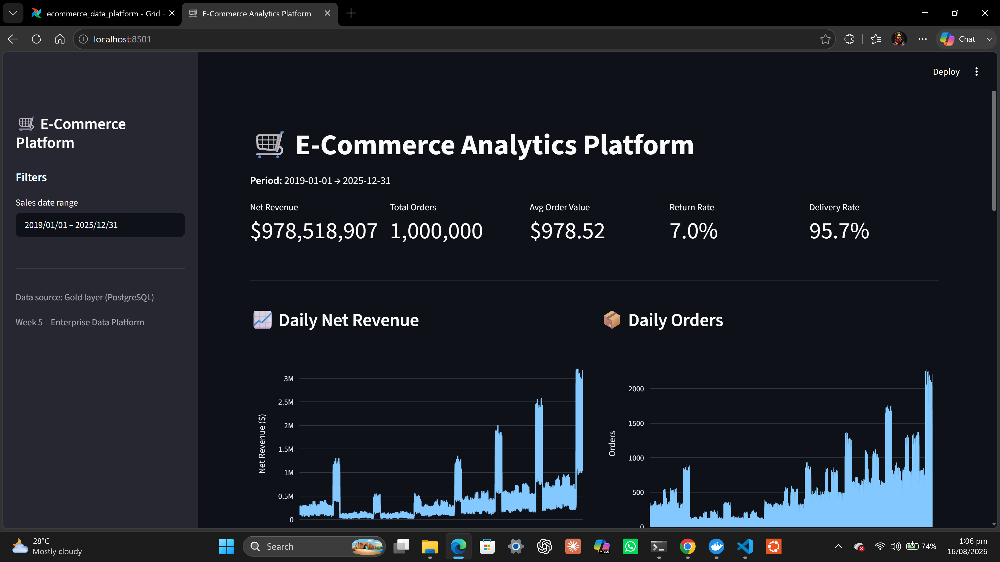
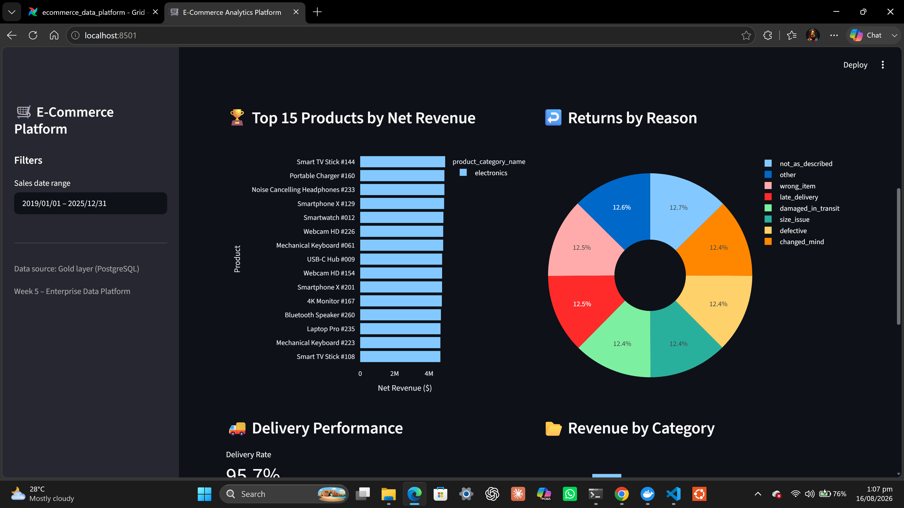
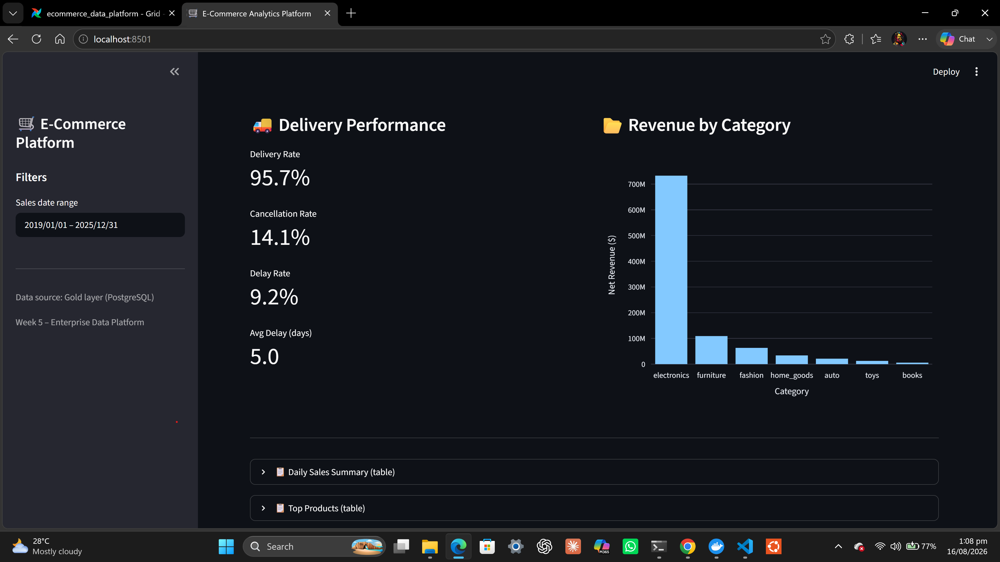
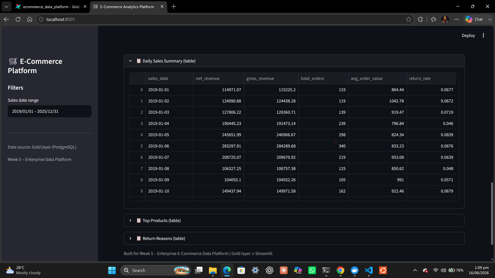
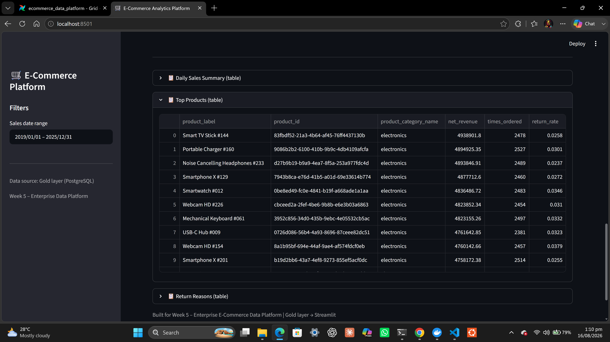
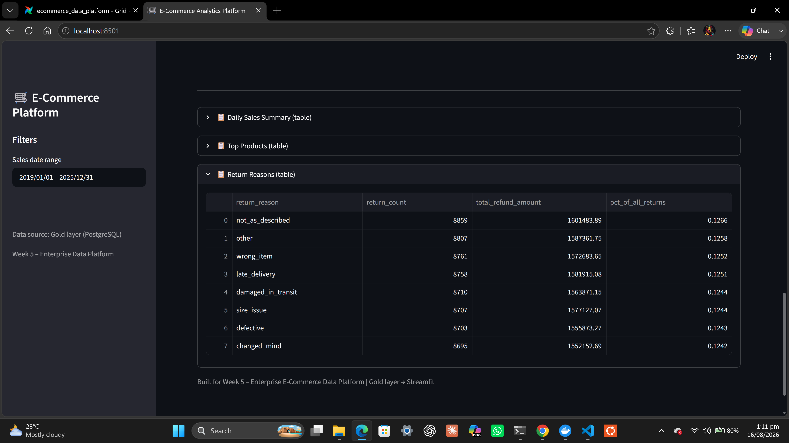

# Enterprise E-Commerce Data Platform

An end-to-end, containerized data platform that turns e-commerce operational data into analytics-ready warehouse tables and an interactive business dashboard. The project implements a **Bronze → Silver → Gold** medallion architecture orchestrated with Apache Airflow.



## Highlights

- Orchestrates the complete pipeline with an Apache Airflow DAG.
- Ingests e-commerce orders, customers, products, and order items from a Kaggle dataset.
- Generates realistic logistics, returns, and inventory partner feeds and lands them in MinIO (S3-compatible object storage).
- Retrieves exchange rates from the Frankfurter currency API.
- Loads source data into a PostgreSQL warehouse using Bronze, Silver, and Gold schemas.
- Runs critical Bronze-layer data-quality checks before transformations continue.
- Provides an interactive Streamlit dashboard for sales, products, returns, inventory, and delivery insights.
- Uses idempotent loading patterns, row hashes, batch metadata, and MinIO file-ingestion logs for traceability.

## Architecture



## Pipeline flow

The `ecommerce_data_platform` DAG runs on demand and performs the following work:

1. Creates the analytics database, schemas, and warehouse tables.
2. Downloads the Kaggle source dataset.
3. Generates realistic seed feeds for order status, returns, and inventory.
4. Uploads the feeds to MinIO.
5. Ingests Kaggle, MinIO, and currency API data into the Bronze layer.
6. Runs Bronze data-quality checks, including null-key, value, duplicate, and referential-integrity checks.
7. Transforms validated data from Bronze to Silver, then to Gold.
8. Confirms the dashboard’s required Gold tables contain data.

## Technology stack

| Area | Tools |
| --- | --- |
| Orchestration | Apache Airflow 2.9.3 |
| Warehouse | PostgreSQL 16 |
| Object storage | MinIO |
| Processing | Python, Polars, Pandas, SQLAlchemy |
| Data quality | Custom Python/SQL checks with persisted results |
| Dashboard | Streamlit, Plotly |
| Infrastructure | Docker Compose |
| Data sources | Kaggle and Frankfurter currency API |

## Data model

| Layer | Purpose | Examples |
| --- | --- | --- |
| Bronze | Source-aligned, traceable landing tables | `orders`, `order_items`, `customers`, `products`, `returns`, `inventory_snapshots`, `currency_rates` |
| Silver | Cleaned and conformed operational entities | `customers`, `products`, `orders`, `order_items`, `returns`, `inventory`, `currency_rates` |
| Gold | Analytics-ready dimensional model and business aggregates | `fact_orders`, `fact_order_items`, `fact_returns`, `dim_customers`, `dim_products`, `daily_sales_summary`, `product_performance`, `delivery_performance` |

## Quick start

### Prerequisites

- Docker Desktop with Docker Compose
- A Kaggle account and API credentials

### 1. Configure environment variables

Create your local environment file from the template:

```bash
cp .env.example .env
```

Update these values in `.env`:

- `KAGGLE_USERNAME` and `KAGGLE_KEY` with your Kaggle API credentials.
- `AIRFLOW__CORE__FERNET_KEY` with a valid Airflow Fernet key.
- Password placeholders such as `POSTGRES_PASSWORD`, `MINIO_ROOT_PASSWORD`, and `_AIRFLOW_WWW_USER_PASSWORD`.

> `.env` is excluded from version control. Never commit credentials.

### 2. Start the platform

```bash
docker compose up --build -d
```

### 3. Open the services

| Service | URL | Default sign-in |
| --- | --- | --- |
| Airflow | http://localhost:8081 | Values from `_AIRFLOW_WWW_USER_USERNAME` and `_AIRFLOW_WWW_USER_PASSWORD` |
| MinIO Console | http://localhost:9001 | Values from `MINIO_ROOT_USER` and `MINIO_ROOT_PASSWORD` |
| Streamlit dashboard | http://localhost:8501 | No sign-in |

### 4. Run the pipeline

1. In Airflow, find `ecommerce_data_platform`.
2. Unpause it if necessary and trigger a manual run.
3. Wait for all tasks to succeed.
4. Open the Streamlit dashboard to explore the Gold-layer metrics.

To stop the stack:

```bash
docker compose down
```

## Dashboard

The dashboard reads from the Gold layer and includes daily net revenue and order trends, product and category performance, return reasons, and delivery KPIs.

| | |
| --- | --- |
|  |  |
|  |  |
|  |  |

## Project structure

```text
.
├── dags/                 # Airflow DAG definition
├── dashboard/            # Streamlit application
├── scripts/              # Kaggle download, seed generation, MinIO upload
├── src/
│   ├── ingest/           # Source-to-Bronze loaders
│   ├── quality/          # Bronze data-quality checks
│   ├── transform/        # Bronze-to-Silver and Silver-to-Gold transforms
│   └── utils/            # Database and hashing utilities
├── sql/                  # Bronze, Silver, and Gold DDL
├── seed_data/            # Generated partner-feed landing files
├── assets/               # Architecture/DAG and dashboard screenshots
├── docker-compose.yml    # Service definitions
└── requirements.txt      # Python dependencies
```

## Data quality and reliability

- Critical validation checks stop the workflow when key fields are missing or values are invalid.
- Non-critical checks surface duplicate, empty-table, and referential-integrity issues.
- Results are stored in `logs.data_quality_results` for auditability.
- Bronze loads retain source system, load timestamp, batch ID, and row hash metadata.
- MinIO file ingestion is checksum-aware and records processed files in `logs.file_ingestion_log`, avoiding repeated processing of unchanged files.

## Useful commands

```bash
# Follow Airflow scheduler logs
docker compose logs -f airflow-scheduler

# Follow all running services
docker compose logs -f

# Stop containers and remove persistent volumes (this deletes local platform data)
docker compose down -v
```

## Data source

The raw e-commerce data is downloaded at runtime from the [Synthetic U.S. E-Commerce Dataset (1M Orders) on Kaggle](https://www.kaggle.com/datasets/limjeongeun/synthetic-u-s-e-commerce-dataset-1m-orders). Currency rates are sourced from the [Frankfurter API](https://www.frankfurter.app/).


